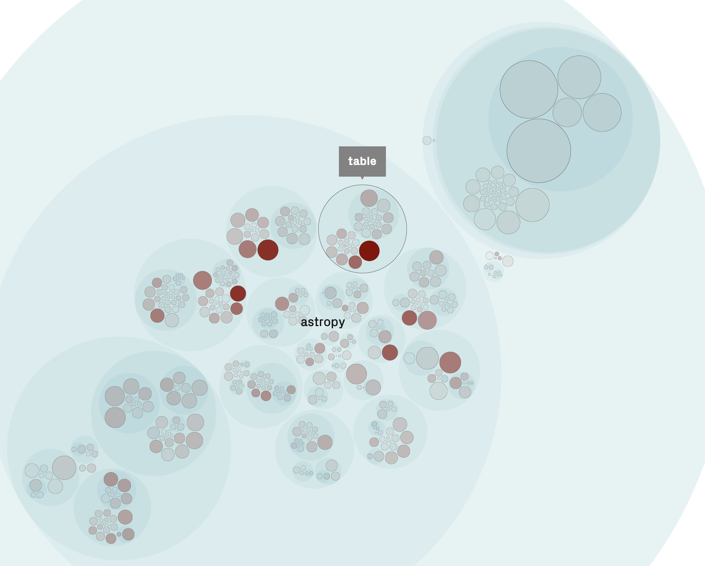

# Lab 3: Static Analysis

Static Analysis means analyzing the code "at rest" or in its non-running form (contrast with dynamic analysis). Static Analysis can be quite complex and powerful, including analyzing code syntax to find null pointers. Type checking is a form of static analysis. But so is code formatting!

In this lab we will keep things simple and focus on understanding the structure of the code with simple tools. You should follow the steps below and walk through them in the lab session. 

# Before the Lab:

For the steps below, you will need to use 3rd party tools to visualize the code. There are many options. Before the lab, get one of them working on your machine. Most are simple to setup with a web server and Github account. Configure it to access the repo you are focused on for this course. Fork that project to your personal account on Github first.

- Understand - https://licensing.scitools.com/login - free Academic licence. 
- SonarCloud - https://sonarcloud.io/pricing - free for open source. Use a Github token.
- CodeScene - https://codescene.io/projects - ditto.
- Code-Inspector - https://www.code-inspector.com/register - ditto.

There are many others you could consider, like Lattix, NDepend, CAST, etc. etc.

# Lab Steps

Your first approach should be your IDE and simple tooling like `grep`. We covered this in the [first week](https://github.com/seng350/course/blob/master/lectures/3-reading.md). 

1. Start by looking at the code in your IDE. What is the directory structure? Do you know why each folder exists? Which ones are relevant, i.e. hold the source or docs? What might you need the others for?

	At this point you should ensure you have the CORRECT repo. In big projects it is not unusual for there to be 4 or 5 different repos to handle different project aspects. 

2. Look at the build script. Can you figure out where the program starts? How is it triggered? In some cases this will be difficult, e.g. if you are studying middleware. Identify the main point of entry. You will probably have to look at some tutorials to get a sense for how it works.  
3. Using the architecture docs, look for the major architectural components of the system. Can you sketch out a **top-down** view of the systems module structures? What are the major abstractions used? 
4. Practice using command line tools. Two that I like a lot are `grep` - the original search function - and [`git log`](https://devhints.io/git-log), which is great for analyzing project evolution. Try grepping for a keyword from the docs, such as "chat". You would do that as
```shell
grep -Rn "chat" *
```

Which will do a recursive search in the current directory for "chat" and print the line numbers. Of course grep is much more useful than this particularly when combined with pipes into other commands. 

```
git log --pretty="format:%an %ar %s "
```

Will show the recent commits with commit message, date, and author. StackOverflow usually has the answers to the syntax required for esoteric queries. Even better, pipe this into grep and you can keyword search the results. 

5. Let's analyze the structure of the code using purpose built tools. Before the lab you should have installed one of the tools I mentioned. We will focus on CodeScene, but the basic ideas are similar for all of them. These static analysis tools focus on project health and code quality. CodeScene in particular is based on the book ["Your Code as a Crime Scene"](https://pragprog.com/titles/atcrime/your-code-as-a-crime-scene/) by Adam Tornhill. CodeScene is particularly focused on social code metrics, such as developer turnover, but has some useful visualizations for understanding the scope of the system. 
6. You *may* need to configure the project first, as shown in this screen: 

That helps prevent analyzing files we don't know much about like .xml. 

After that, you can explore the codebase. In some tools like CodeScene and NDepend, you can create architectural structures and have the tool fill in the details. See https://codescene.io/projects/1372/config/architectural



Here you can see a typical view. The tool has created modules for us, based on file structure. We can browse the modules - which are sized by lines of code - to see what CodeScene calls hotspots, aka places where the code has quality problems. On the right column you can see metrics associated with the file(s) you are currently highlighting. We aren't too focused on the metrics or quality at this point, of course, but it might be interesting to browse. 

## Summary

There are many many tools for looking at code (in fact, Github itself is quite useful here as well). Find a few tools you like and use them to dig into your code from the top down. You might want to load all 3 projects into the same tool in order to compare relative file sizes and code quality. 
