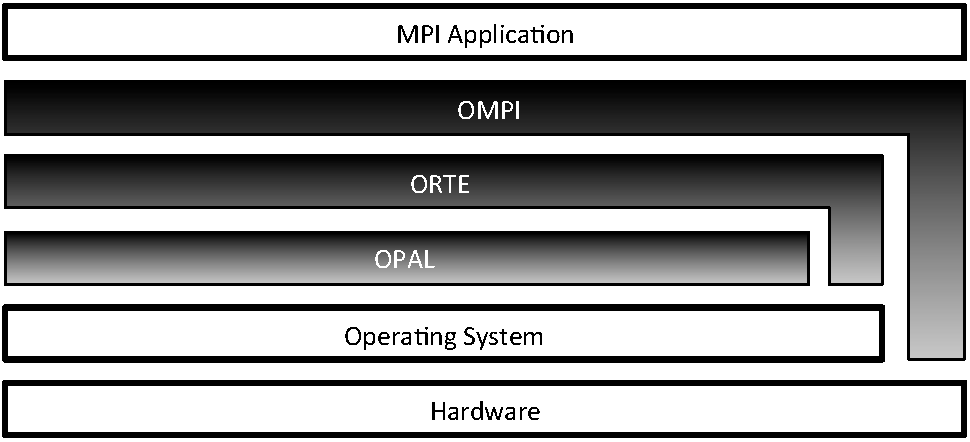

# OpenMPI

- what is it? It is itself an abstraction! 

----
# Resources
* [Wikipedia](https://en.wikipedia.org/wiki/Message_Passing_Interface)
* [Standard](https://www.mpi-forum.org/docs/mpi-3.0/mpi30-report.pdf)
* [Repo](https://github.com/open-mpi/)

----
# ASRs
What are the ASRs for MPI scenarios? Parallel computing and high performance aka scientific computing

- low latency
- lots of messages 
- power consumption and efficiency
- support more features, environments, and networks 
- large complex C code base

----
# Arch decisions:
- use layering to group functionality
- use plugins for extensibility
- keep focus on performance

----
# Arch - modules

----
# Hatful of MPI Quotes
I will give you each a quote from the AOSA chapter. Working with your neighbour, consider what abstractions are being discussed or could help. Evaluate the abstraction on the criteria from previously, and if possible, track down a place in the source code or standard where you can see that working. 

Then share with the class your thoughts on how this abstraction works - both for the implementers (ie. the MPI devs) and users. 

----
# Quotes
All quotes are from the AOSA chapter.

See the Github markdown page for the list of quotes. Then, read the quote that is closest to the first letter of your first name. I.e., if your name is Neil, you would read quote 5. 

1: A-C
2: D-F
3: G-I
4: J-L
5: M-O
6: P-R
7: S-U
8: V-X
9: Y-Z