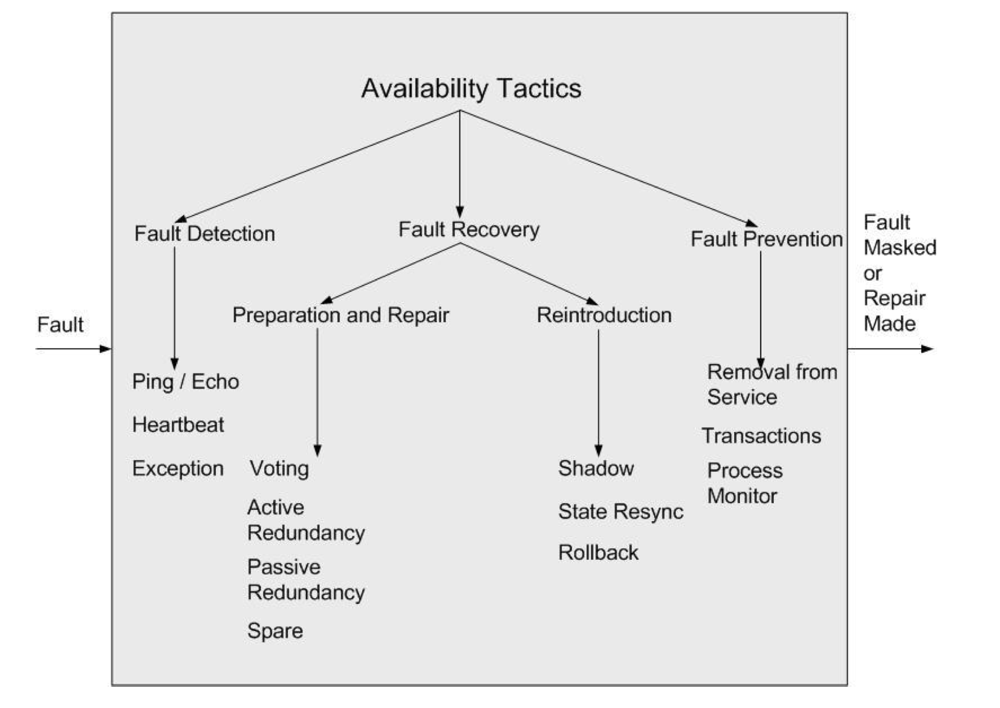

<!-- 
Structure for the next few weeks:

1. Introduce the tactic category. Discuss scenarios and measures.
2. Discuss tactics to solve the QA problem. Introduce common libraries/services.
3. Examine how Home Assistant implements some of these tactics. -->
<!-- 
# Tactics

Architectural tactics are design approaches to achieve a required quality attribute (p. 70).  Tactics ignore tradeoffs. They focus on the solution, and the designer needs to balance tradeoffs. Unlike patterns, tactics do not focus on tradeoffs, and tend to be more abstract, allowing for easier customization, regardless of the system. Thus, tactics need to be refined for a particular system, either by explaining how to implement the tactic or what library to rely on. As we will see, a number of tactics are either subsumed in common language functions, or supported by outsourcing the quality attribute to third parties.  -->

# Availability (ch 4)

----

## Availability

Availability is about design to 
> ``enable a system to endure system **faults** such that a service being delivered by a system remains compliant with its spec". 

A fault is a problem that impairs but does not prevent the software from working. Examples:

- node (machine/instance) loss in a distributed system
- service loss in a micro service

----

----

Availability in the distributed system sense refers to nodes - eg. an API endpoint or IP address for a server - being able to handle requests when needed. In particular, we would like to minimize outage time. 

| Availability | Downtime/90 days | Downtime/Year |
| -----| ----|----|
|99.0 % ('two-nines') |  21 hr 26 min | 3 days, 15.6 hr |
| 99.9%  | 2hr,10min | 8hr, 0min,46sec|
| 99.99 %  | 12 min, 58 sec | 52 min, 34 sec |
| 99.999 %  | 1 min, 18sec | 5 min, 15 sec |
| 99.9999 % | 8 sec | 32 sec |

As we have discussed, each increase in availability requirement has a corresponding shift in how we would architect to support that more stringent requirement. At 2 nines, we can tolerate taking an entire machine offline to patch it in a day. At 6 nines, that machine can effectively never be down. The difference between these constraints has a marked effect on the design we will choose for our system. 

How do these manifest in practice? Nowadays they tend to appear in service-level agreements with providers like [Microsoft Azure](https://azure.microsoft.com/en-gb/support/legal/sla/virtual-machines/v1_8/). E.g.,

> For all Virtual Machines that have two or more instances deployed across two or more Availability Zones in the same Azure region, we guarantee you will have Virtual Machine Connectivity to at least one instance at least 99.99% of the time.

> For all Virtual Machines that have two or more instances deployed in the same Availability Set, we guarantee you will have Virtual Machine Connectivity to at least one instance at least 99.95% of the time.
> 
> For any Single Instance Virtual Machine using premium storage for all Operating System Disks and Data Disks, we guarantee you will have Virtual Machine Connectivity of at least 99.9%.

Note the constraints in the first SLA: 2 availability zones in the same region. This exposes a bit of how Microsoft's ops teams are designing the system to meet the SLA. 

# Common Scenarios
Each availability scenario will consist of an incoming *fault*, a response, and either the fault being repaired, or masked until it can be properly fixed.

(Brainstormed scenarios)

# Tactics
The availability tactic tree is shown below (see textbook). 

Broadly we need to be concerned with detecting there was a fault (otherwise, we cannot fix it and recover), recovering from the fault, and preventing the fault in the first place. 

Keep in mind that for each *tactic* there are multiple ways to actuall implement it. 

## Fault Detection

* **Ping Echo**: determine reachability and round-trip time measurements. Asynchronous. Implementation concerns: voting on echos, ping delay. See **ICMP** 
* **System Monitor/Heartbeat**: detect runaway/hung process. Periodically reset a timer/watchdog,  if expired, problem exists. Heartbeat indicates is a periodic message exchange indicating good health. Implementation concerns: how big is the message? How many are being sent? What if the availability system itself fails? 
* **Exception**: standard Java model: when error occurs, wrap it in exception object to exit current execution context and enter error context. Implementation concerns: asynchronous, debugging challenge. Exceptions as GoTos.
* **Voting**: revised in new article to be about fault detection. Triple redundant observer modules vote periodically on current state of system. E.g., air speed indicators in an airplane. [MongoDB uses voting](https://docs.mongodb.com/manual/core/replica-set-elections/) to handle node partitions. If the primary goes down, the secondary servers in the replication set have to decide which becomes the new primary. Implementation concerns: how many votes? Threshold for winning election. 

## Fault Recovery
### Preparation and Repair 
* **Active/Passive Redundancy**: Hot/Warm redundancy, where the temperature refers to how ready the spare is.  Create a protection group of a leader + spares. Active: spares are synchronous with leader. Fast failover. Passive: state is only synchronized periodically. Can also exist at the service level: see Netflix's [Active-Active](https://medium.com/netflix-techblog/active-active-for-multi-regional-resiliency-c47719f6685b) availability approach (99.99% target). Each Netflix service runs in 2 regions, and duplicates all events inside each region. Thus, a failure in AWS Us-West-2 will not affect the service, because the hot spare in US-East-1 can be called in.
  * Services are stateless - except in data tier.
  * Resources access only within a Region.
  * No cross-region calls in a given call path.
* **Spare**: 'cold', no synchronization. Better for reliability than availability (reliability+recovery).
* **Patching mechanisms**: support the ability to patch code either in real time (e.g., hot swapping using function pointers), or replace running code components. See Microsoft's [dynamic patching](https://techcommunity.microsoft.com/t5/Azure-SQL-Database/Hot-Patching-SQL-Server-Engine-in-Azure-SQL-Database/ba-p/849700) for SQL Server in Azure (99.995%). Need to design things that can be resumed/checkpointed, modify memory with new binary, then redirect instruction pointers to new/patched code. Implementation questions: hot/cold patches, how to test new patched code. 

### Reintroduction
* **Shadow**: the failed component/service becomes a spare, and is then re-introduced as leader
* **Rollback**: checkpoints are created to allow system state to be reverted if a failure occurs. E.g., in [CRIU](https://criu.org/Main_Page) Linux systems can save current state of a program to disk. Could use it to save state for future re-use. Implementation questions: how long to go before rolling back (rock climbing analogy)

## Fault Prevention
* **Removal from Service**: pull the faulty machine out of service and fix the underlying problems (e.g., bitrot, faulty boards). Implementation questions: mean rate of failure, how to redirect traffic.
* **Transactions**: Ensure that if a fault does happen, no data loss occurs. For example, 2-Phase Commit is a tactic that ensures that changes are only written to the data store if all nodes are ready to accept the transaction (distributed consensus). Combined with rollback to allow failed transactions to be "undone".

# Tactic Analysis

One use for tactics is to support reasoning using analytic models. If we have a good understanding of the tactic, we could use approximate reasoning to get a sense for whether the tactic will help meet the desired properties. For example, we could get pretty good estimates for how long a hot spare will take to assume control (say 5ms), and use probabilistic modeling - Markov chains for example - to simulate and get a sense for how probable we are to meet a particular goal. 

# Examples in Home Assistant

What are some availability scenarios for a home-assistant install? 

1. When I access the Hub, the Hub is always available for input.
2. When a single IOT device fails, the Hub does not slow down processing of other events.
3. If a power outage kills the hub, the fact it went offline is always sent to an independent log file. 
4. When an airbnb guest arrives and the owner is not home, the smart-lock can never go offline.

- Heartbeat: https://github.com/home-assistant/home-assistant/blob/05ecc5a1355c7af11b5d310470a6171528dc7a2b/homeassistant/components/mysensors/handler.py
- Rollback: https://github.com/home-assistant/home-assistant/blob/05ecc5a1355c7af11b5d310470a6171528dc7a2b/homeassistant/components/recorder/util.py#L15
- Redundancy idea: https://github.com/home-assistant/home-assistant/issues/11727

# References
1. [SEI article](https://resources.sei.cmu.edu/asset_files/TechnicalReport/2009_005_001_15101.pdf) 
2. Release It! By Michael Nygard
   3. [Chaos Engineering](https://www.oreilly.com/library/view/chaos-engineering/9781491988459/) (Netflix) by Basiri et al.	
