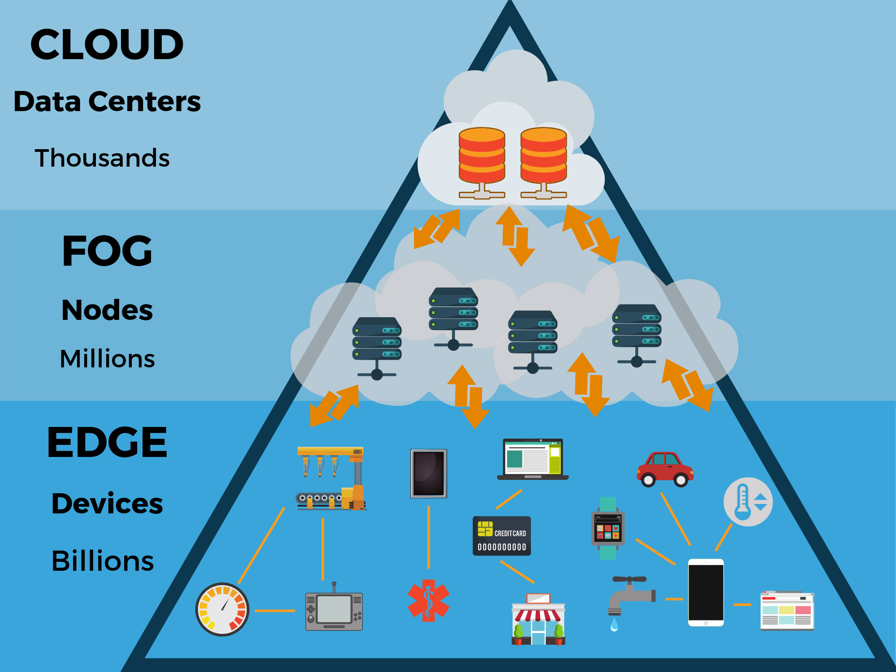
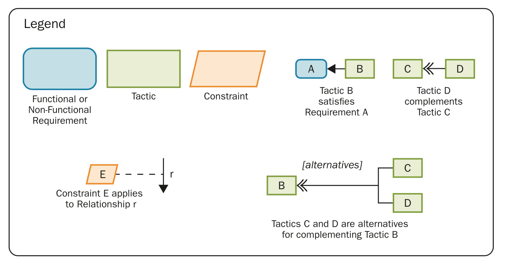
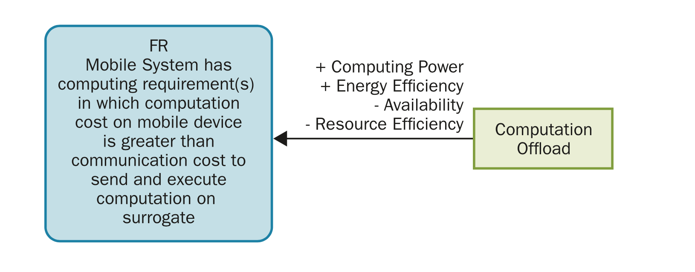
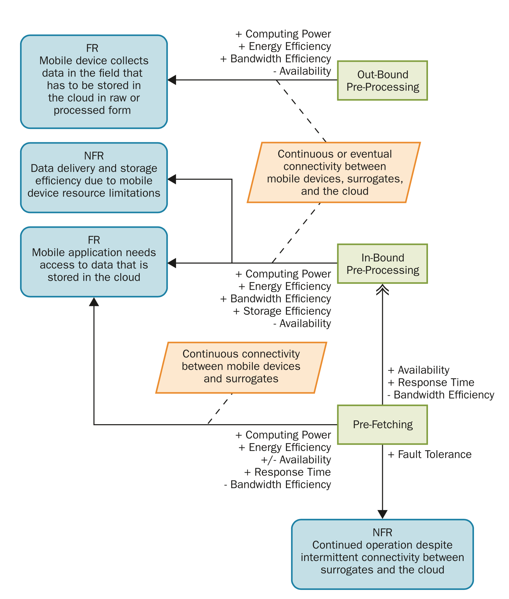
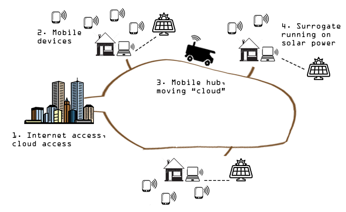
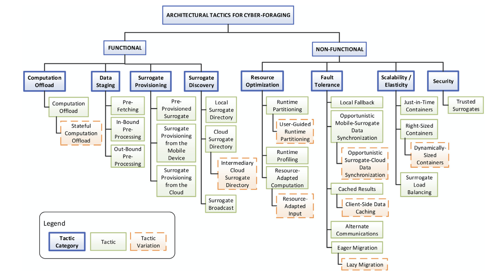

----
Title: Edge Computing
Author: Neil Ernst
---

*(Material for this lecture heavily derived from the work of [Grace Lewis](https://scholar.google.ca/citations?hl=en&user=uwshWMoAAAAJ&view_op=list_works&sortby=pubdate), especially this paper.)*

[Edge Computing](https://www.thinkebiz.net/what-edge-computing/) is a paradigm that explores moving processing and storage capacity to the 'edge' of the network. Where Cloud moves processing directly to a remote datacenter (usually run by some other company), Edge (and the intermediary, "Fog"), either leave processing or storage on-node (e.g., within a smart home hub, or a car) or send it to a closer/cheaper/more accessible intermediary.

Consider the case of a drone being used for crop surveillance (or a satellite). The drone is imaging terabytes of data per day, but most of the data is probably not important (see Performance tactics). We might only want to see places where chlorophyll (plant productivity) is below a given threshold. 

We therefore have a few design choices. One, we put a big storage device on the drone, let it process the data on-device ("edge"), and send the processed data to our cloud endpoint (some analytics dashboard, for example, using Kibana). Two, we could send *all* the raw data to the endpoint, and let the endpoint handle data storage. What's the tradeoff here? 

(Processing vs storage capacity vs network bandwidth)

How would your decision change if the drone was flying on Mars, instead of Earth?

Within the concept of edge, cyber-foraging is a technique to enable mobile devices to extend their computing power and storage by offloading computation or data to more powerful servers located in the cloud or in single-hop proximity.  One obvious application area is (?) - augmented reality computing. Cloudlets are essentially small, flexible data centres that can be quickly provisioned 

Benefits:
* energy efficiency, 
* reduced latency, and 
* increased availability, 

## Basic Scenario

Need for local, low-latency processing → tactics → processing task done within processing constraints and result returned to edge device.

# Tactics

## Computation staging

## Data Staging

## AgroTempus Case Study

One need in countries with weaker national connectivity is to support data intensive, computational processing tasks without connecting to (or assuming a connection to) a high capacity data centre such as AWS Us-East. Often these countries have decent cell networks but poor computer/data networks. Thus *surrogates* for data collection are usually cell phones or Raspberry PIs, with limited on-device processing and storage. An Edge computing approach could periodically retrieve data from the surrogates and then upload it to a data centre (possibly by driving it in via ["SneakerNet"](https://blog.jgc.org/2010/07/bandwidth-of-fully-laden-747.html)). 

[AgroTempus](http://reuelbrion.github.io/AgroTempus/) is a case study that looks at support for doing this. 

As a research project, the authors looked at how the system could be implemented using the cyber-foraging tactics below. Like the SKA project, AgroTempus ran experiments to see if the tactics made sense for the system. E.g., to test data offload, the code implements weather forecasting by offloading data to the mobile hub, then performing the calculation, then sending the simple prediction back to the mobile device. 

# Functional Tactics

| Tactic                                               | Description                                                  |
| ---------------------------------------------------- | ------------------------------------------------------------ |
| Computation Offload                                  | Mobile clients offload expensive computation to surrogates. Computation is self-contained in the form of a module, class, service, or complete application. |
| Stateful Computation Offload                         | Mobile clients offload expensive computation to surrogates. Because the granularity of the offload operation is at the process or at the method level, the state of the program or object that contains the process or method being offloaded has to be transferred to the equivalent program or object on the surrogate to guarantee that state is equivalent on both the mobile device and the surrogate. |
| **Data Staging** Pre-Fetching                        | Surrogate anticipates mobile device data needs in order to minimize direct communication to the cloud and reduce latency. |
| In-Bound Pre-Processing                              | Surrogate pre-processes the data that is retrieved or pushed from the enterprise cloud such that the mobile device receives data that is ready to be consumed, or filtered such that it only receives data of interest or relevance. |
| Out-Bound Pre-Processing                             | Surrogates collect data from mobile devices and pre-process the data – clean, filter, summarize, or merge – such that the data that is sent on to the enterprise cloud is ready for consumption and serves an immediate need. |
| **Surrogate Provisioning** Pre-Provisioned Surrogate | Surrogates are provisioned before their deployment with the capabilities that are offloaded by mobile clients. |
| Surrogate Provisioning from the Mobile Device        | The mobile device sends the offloaded computation to the surrogate at runtime. The surrogate installs the computation inside an execution container. |
| Surrogate Provisioning from the Cloud                | At runtime, the mobile device sends the location of the offloaded computation in the form of a URL for the surrogate to download and install. |
| Surrogate Discovery Local Surrogate Directory        | Mobile devices maintain a list of surrogates with their network addresses or URLs, in addition to any information that can help the mobile device to select the best offload target in case more than one is available. |
| Intermediary Cloud Surrogate Directory               | A centralized surrogate directory is maintained in the cloud and queried by mobile devices at runtime. All surrogate metadata is populated and updated in this central repository. |
| Cloud Surrogate Directory                            | The cloud surrogate directory does not return the surrogate address to the mobile device, but rather forwards the offload request to a selected surrogate and then returns the results to the mobile device, therefore acting as an intermediary. |
| Surrogate Broadcast                                  | Surrogates advertise their availability and selected metadata to mobile devices for discovery. |

 One thing to take-away from this emerging area is simply this. Software is an ever-changing thing, inconstant. Being able to navigate novel architectural concepts and map them to problems is important for longer-term success in the field. Cyber-foraging shows one area that demonstrates this. I hope you think about how you will understand how to continually improve your personal learning. The language of tactics and quality attribute scenarios is one good way to frame the problem.

# References

* NIST, [Fog Computing standard](https://nvlpubs.nist.gov/nistpubs/SpecialPublications/NIST.SP.500-325.pdf)
