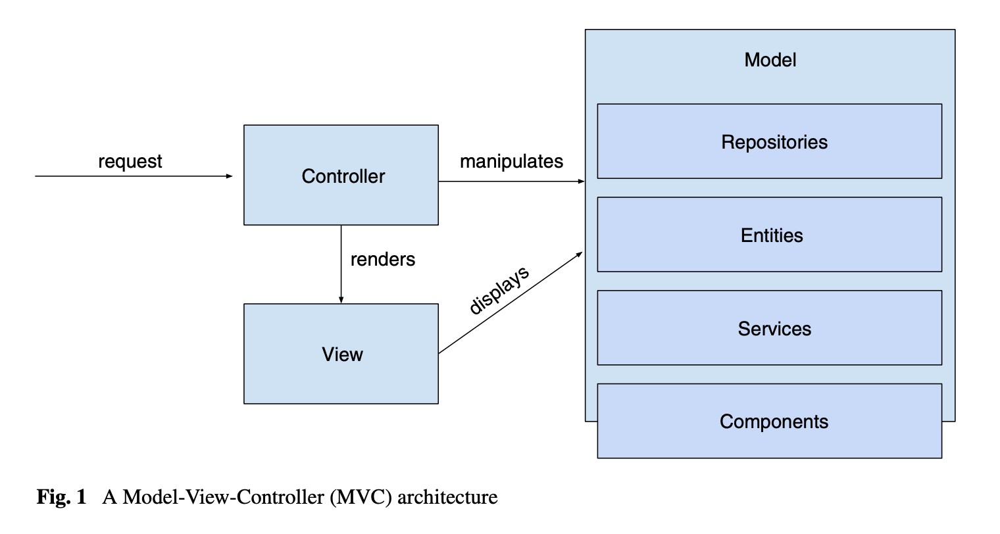

----
Title: Modifiability	 

Author: Neil Ernst
----

The "modifiability of a software system is the ease with which it can be modified to [respond to] changes in the environment, requirements or functional specification. " (Bosch). Synonyms include maintainability, modularity, sustainability.

In the 1960s IBM embarked on what was one of the largest software projects ever attempted, to create an operating system for their new line of mainframes. This project, [OS/360](https://en.wikipedia.org/wiki/OS/360_and_successors), went over budget and schedule, and two influential software engineering ideas emerged from it. The first is that software isn't something you can just add more personnel to speed up development time. This is Fred Brooks's *Mythical Man-Month* book. 

The second is that software continually changes and needs ongoing investment to prevent it from descending into chaos. This was captured as Manny Lehman and Laslo Belady's [work on software evolution,](https://en.wikipedia.org/wiki/Lehman%27s_laws_of_software_evolution) particularly the law of continuing change. 

More recently this concept has been crystallized as the notion of *technical debt*: the idea that short-term approaches for fixing bugs or adding new features comes at the expense of long-term sustainability of the software. 

A good resource for data science on software is from [Derek Jones](http://www.knosof.co.uk/ESEUR/).

# Modifiability Scenarios

The modifiability approach captured in the textbook describes this scenario as 

> change arrives → tactics are applied → change is made within time and budget.

Note that we assume, in the modern era, that **making** a change means:

1. Functionally correct, i.e., no bugs

2. Tested

3. Deployed to production

What are some sample modifiability scenarios? 

<discussion>

For HomeAssistant, examples include

* A new software version of the Philips Hue IOT lighting control system is released, with breaking changes. Home Assistant can release an update to manage this change within 2 business days. 
* An exploit has been identified in the SSH package HA uses for remote access. The new OPenSSH library is deployed in 2 hrs
* A disclosure allowing remote root access is emailed to HA maintainers. HA removes the exploit in the distribution and issues a patch online within 2 hrs.
* The current approach to packet control is too slow. A team has been researching new packet control approaches. The replacement of the old system happens within 2 weeks, and there are no breaking changes.

# Software Metrics and Analytics

A big part of software engineering these days is software analytics. This refers to the use of data science for improving and understanding the software and software process. As part of the project, you are using analytics to understand your code better. For example, some companies measure the number of lines of code their developers added. This is generally [a terrible idea](https://www.martinfowler.com/bliki/CannotMeasureProductivity.html), and analytics projects are usually better off measuring the code itself, rather than the people creating it. 

## SonarQube exercise

- read SonarQube analysis for HomeAssistant. 
- Five minutes of exploring the report at https://sonarcloud.io/dashboard?id=seng350_home-assistant. Focus on "[Measures>Maintainability](https://sonarcloud.io/component_measures?id=Mongo&metric=Maintainability)"
- Where should we invest 2 weeks of developer time, according to the dashboard? 
- What is the long-term trend in how many maintainability issues the code has? 

## BetterCodeHub 10 rules

See examples at bettercodehub.com and book by Visser below.

*Write short units of code*
 Shorter units (that is, methods and constructors) are easier to analyze, test, and reuse. 

*Write simple units of code*
 Units with fewer decision points are easier to analyze and test. 

*Write code once*
 Duplication of source code should be avoided at all times, since changes will need to be made in each copy. Duplication is also a source of regression bugs. 

*Keep unit interfaces small* 
 Units (methods and constructors) with fewer parameters are easier to test and reuse. 

*Separate concerns in modules*
 Modules (classes) that are loosely coupled are easier to modify and lead to a more modular system. 

*Couple architecture components loosely* 
 Top-level components of a system that are more loosely coupled are easier to modify and lead to a more modular system. 

*Keep architecture components balanced* 
 A well-balanced architecture, with not too many and not too few components, of uniform size, is the most modular and enables easy modification through separa‐ tion of concerns. 

*Keep your codebase small* 
 A large system is difficult to maintain, because more code needs to be analyzed, changed, and tested. Also, maintenance productivity *per line of code* is lower in a large system than in a small system. 

*Automate development pipeline and tests* 
 Automated tests (that is, tests that can be executed without manual intervention) enable near-instantaneous feedback on the effectiveness of modifications. Man‐ ual tests do not scale. 

*Write clean code* 
Having irrelevant artifacts such as TODOs and dead code in your codebase makes it more difficult for new team members to become productive. Therefore, it makes maintenance less efficient. 

## Technical Debt

Philippe Kruchten has a nice conceptualization of what role technical debt plays in software development.

Here TD is seen as an invisible, negative value for your code. Again, in the extremely short term TD is not bad. It become bad as time passes and the debt accrues. 

We call the impact of accrued debt *interest*, which refers to the ongoing added costs you have to pay. This can be in terms of longer release times, longer test runs, cognitive burden on developers, or other measures of impedance caused by imperfect code.

## Class-Responsibility-Collaborator Models

Aka CRC models

### CRC cards exercise

Introduce CRC cards. Class-Responsibility-Collaborators. This is from Beck and Cunningham, “A Laboratory for Object Oriented Thinking”, OOPSLA 1989. See also Rebecca Wirfs-Brock, "Responsibility Driven Design"

1. *Class*: the name of the class/object which we assign a role. 
2. *Responsibilities* - problems to be solved. Aggregation of methods/messages.
3. *Collaborators* - objects sending or receiving messages to satisfy responsibilities

Use them with MVC example. We outlined the three cards.

- **View** - Render the Model & Transform Coordinates - Controller/Model
- **Model** - Maintain Problem info & Broadcast change notifications - Limited collab
- **Controller** - Interpret user input & Distribute control - View/Model

Tips:

* Organize spatially to reflect design (groups and abstractions)
* Start with knowns, and work from there
* When a card is too crowded, move responsibilities to an unnamed card

# Modifiability tactics

(Chapter 7)

## Tactics in Detail

Parameters that matter: 
- coupling - decrease the cost of modifying B, if A changes
- cohesion - remove responsibilities that aren't changing 
- size - longer code is generally harder to understand, increasing change costs/time.
- binding time - it is generally a good idea to support changes late in the life-cycle, but there is a tradeoff with the cost of preparing for those changes.

### Tactics
* *Reduce Size/Split Module*: given a responsibility, replace it with two sub-responsibilities. Each child is independently modifiable. Implementation concerns: identifying detail changes likely; how to capture the resulting coupling.
* *Increase Cohesion/Semantic Coherence*: move things that change together into a common location. Implementation concerns: where should the common location be; what is actually common/shared.
* *Encapsulate*: hide implementation by introducing an interface. Implementation concerns: once hidden, interface is a contract that must be adhered to; possible leaky abstractions.
* *Use an Intermediary*: decouple responsibilities. Ensures that e.g. publishers need not be aware of their subscribers. Implementation concerns: similar to Encapsulate.
* *Restrict Ability to Use Modules*: hide modules with visibility modifiers (private/package/public) or using layers. See Encapsulate
* *Refactor*: identify common responsibilities and 'pull up' those common elements into a single function or module. Implementation concerns: when to refactor; how common the function really is; where the common package lives.
* *Abstract*: parameterize common services and adapt internally to the slight differences in, for example, authenticating basic and admin users.
* *Defer Binding*: Ideally we bake in the flexibility to parameterize large chunks of the application. This allows us to worry about the specifics closer to when the system will be delivered. For example, we might want to avoid committing to a particular data storage approach. Some implementation approaches: 
  * Use dependency injection (e.g. Guice, Spring)
  * Parameter and config files
  * Component replacement
  * Plugin architectures like Eclipse
  * Pub-sub designs
  * Name servers and registries

## MVC and Modifiability Tactics

The paper linked to below from the SEI explains how these tactics can be implemented using architecture patterns like layering, brokers, blackboard, and MVC. Let's examine MVC in detail.

### Forces
Forces are the context for why we choose MVC, and sources of change (stimuli) in our QAS models.

- *The same information is presented differently in different windows.* 
- *The display and behavior of the application must reflect data manipulations immediately.* 
- *Changes to the user interface should be easy, and even possible at runtime.* 
- *Supporting different ‘look and feel’ standards or porting the user interface should not affect code in the core of the application.* 

### Tactics supported by the Patter

- **Maintain Semantic Coherence.** According to the definition, the model component contains the functional core of the application, requiring all the necessary responsibilities for those concepts to be located within the model. 
- **Use Encapsulation.** The model component encapsulates the functional core data and func- tionality. 
- **Use an Intermediary.** The controller acts as an intermediary between the input device and the model. The view acts as an intermediary between the model and the output device. 
- **Use Runtime Binding** Views can be opened and closed dynamically, and different views can be bound to the data at different times during execution. 

## Code Smells and MVC

It is useful to consider how metrics for modifiability and tactics intersect. One approach is to identify particular pattern 'smells' that represent violations of the tactics.

Aniche et al (2018) investigated code smells for MVC architectures. They proposed the following 6 smells in MVC, using the architectural dexcription shown below:

| Smell | Explanation                 |
| ---------------------- | --------------------------------------- |
| Promiscuous Controller | Offer too many actions  (e.g. 1000 routes)                |
| Brain Controller       | Too much flow control (instead of in Model/Entity/Service) |
| Meddling Service       | The service directly query the database (instead of via DAO) |
| Brain Repository       | Complex logic in the repository (e.g. complex SQL queries) |
| Laborious Repository   | A method having multiple actions (e.g. storing more than one Model object) |
| Method Fat Repository  | A repository managing too many entities (e.g. > 1) |

# Modifiability Tactic Examples in Home Assistant

Find examples of three of the tactics in Home Assistant's source code.

# Further Reading

- The text draws on a longer paper [published here](https://resources.sei.cmu.edu/library/asset-view.cfm?assetid=8299).
- Brooks, Mythical Man-Month
- D.L. Parnas. “On the Criteria to Be Used in Decomposing Systems into Modules,” *Communications of the ACM* 15(12)(December 1972). 
- Parnas, “Designing Software for Ease of Extension and Contraction,” *IEEE Transactions on Software Engineering,* SE-5, 2 (1979), pp. 128-137. 
- Visser, J. (2016). Building Maintainable Software: Ten Guidelines for Future-Proof Code. O’Reilly.
- PerOlof Bengtsson , Nico Lassing , Jan Bosch and Hans van Vliet, Analyzing Software Architectures for Modifiability.
